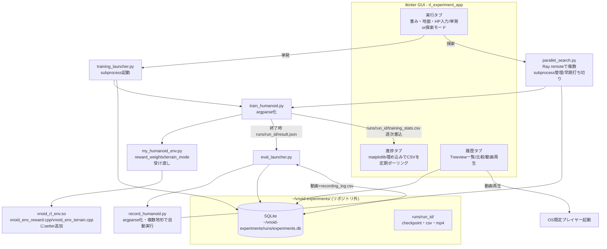

# tkinter製 強化学習実験管理アプリ

## 背景と方針

`for-lecture/知能化生産システム論期末レポート.txt` で提案されている手動フロー（①報酬重みをエディタで直接書き換え → ②ターミナルで学習起動 → ③ログを目視でグラフ化 → ④チェックポイント指定でログ取得スクリプト手動実行 → ⑤⑥⑦ログ整理保存 → ⑧次の重み決定 → ⑨繰り返し）を、`for-lecture/` のtkinterサンプル（`tk-tuto1.py`〜`tk-tuto5.py`, `tk-demo.py`, `carTEST2.py`）で使われている `tk.Frame` / `grid`・`place` レイアウト、`Entry`/`Button`/`Label` の書き方を参考にしたtkinterアプリに置き換える。

対象は研究で実際に使っているコード（`controller/vnoid_rl_env/`配下のC++一式、`python_scripts/train_humanoid.py`、`python_scripts/record_humanoid.py`、`python_scripts/my_humanoid_env.py`）。これらは現状、報酬重み・地面パラメータ・ハイパーパラメータがファイル内にハードコードされており、CLIから変更できない。まずこの部分を改修してから、その上にGUI+DB+並列探索+自動評価を載せる。

フルスコープ（レポートの4モジュール全部）で実装する。学習の実行自体（Ray/GPU/ビルド済みC++モジュールが必要）は本開発環境では動作確認できないため、C++のビルド確認とGUI単体の動作確認はここで行い、実際の学習ジョブの動作確認はユーザーの実行環境で行う前提とする。

### コード整理後の前提（2026-07-25更新）

リポジトリ側で以下の整理が行われた。今回のPlanはこれを前提に更新している。

- `controller/vnoid_rl_env/bindings.cpp` は責務ごとに分割済み（`vnoid_env.h`, `vnoid_env_lifecycle.cpp`, `vnoid_env_episode.cpp`, `vnoid_env_reward.cpp`, `vnoid_env_terrain.cpp`, `vnoid_env_logging.cpp`, `vnoid_env_render.cpp`。詳細は`controller/vnoid_rl_env/README.md`）。`bindings.cpp`自体はpybind11のモジュール定義のみを残した薄いファイルになった。
- 過去の実験フォルダ・チェックポイント・zip類はリポジトリ外の `~/vnoid-experiments/archive/` に退避済み。
- 今後の学習実行で生成される**チェックポイント・CSVログ・録画・DBファイルは全てリポジトリ外の `~/vnoid-experiments/runs/<run_id>/` 以下に書き出す**（リポジトリのルートや`python_scripts/`直下には生成物を置かない）。これによりリポジトリはコード専用、`~/vnoid-experiments/`がデータ専用という分離になる。

## 全体アーキテクチャ



## 1. 既存コードの改修（研究本体のコード）

### `controller/vnoid_rl_env/` (分割済みC++モジュール)

報酬重み(`w_track`, `w_act`, `w_healthy`, `tracking_sigma`)は`vnoid_env.h`のメンバ変数(L107-110)でハードコードされており、setterが無い。地形切り替え関数(`apply_hard_terrain`/`apply_soft_terrain`/`apply_random_terrain`)は`vnoid_env_terrain.cpp`に実装済みだがprivateかつpybind11未公開(`vnoid_env.h` L152-155)。

```106:110:/home/satoshi/vnoid-mujoco/controller/vnoid_rl_env/vnoid_env.h
    // reward params (1歩スケール)
    double w_track = 1.0;
    double tracking_sigma = 0.02; // 1歩変位誤差のスケール
    double w_act = 0.1;          // まずは0から導入（弱いペナルティ）
    double w_healthy = 1.0;
```

- `vnoid_env.h`: 上記メンバをpublicな`set_reward_weights(w_track, w_act, w_healthy, tracking_sigma)`から更新可能にし、`apply_hard_terrain`/`apply_soft_terrain`/`apply_random_terrain`をpublicセクションに移動（または`set_terrain_mode(const std::string&)`という薄いpublicラッパーを追加）
- `vnoid_env_reward.cpp`: 上記setterの実装を追加（既存の`reward_tracking()`等はそのまま）
- `vnoid_env_terrain.cpp`: 変更なし（既存関数をそのまま公開するだけ）
- `bindings.cpp`: `.def("set_reward_weights", &VnoidEnv::set_reward_weights)` と `.def("set_terrain_mode", &VnoidEnv::set_terrain_mode)` を追加

```1:15:/home/satoshi/vnoid-mujoco/controller/vnoid_rl_env/bindings.cpp
PYBIND11_MODULE(vnoid_rl_env, m) {
    py::class_<VnoidEnv>(m, "VnoidEnv")
        .def(py::init<const std::string&>())
        ...
        .def("clear_control_log", &VnoidEnv::clear_control_log);
}
```

改修後 `controller/vnoid_rl_env/README.md` の公開メソッド表・データフロー図も追記し、`cmake --build build` で再ビルドしてコンパイルが通ることを確認する。

### `python_scripts/my_humanoid_env.py`

`__init__`（L39-)で `reward_weights: dict | None` と `terrain_mode: str` を受け取り、`self.cpp_env` 生成直後に `set_reward_weights(**reward_weights)` と対応する `apply_*_terrain()` を呼ぶ。`tune.register_env` のlambda（L161-165）にも `reward_weights`/`terrain_mode` をenv_configから渡すよう拡張。

### `python_scripts/train_humanoid.py`

固定値（`NUM_WORKERS`, `lr=1e-4`, `gamma=0.99` など L18-64、固定CSV名`training_stats_.csv` L77、固定チェックポイント名`humanoid_vnoid_checkpoint` L74）を`argparse`化：
`--run-id, --run-dir, --w-track, --w-act, --w-healthy, --tracking-sigma, --terrain, --lr, --gamma, --num-workers, --num-iterations, --seed`
`--run-dir`未指定時は`~/vnoid-experiments/runs/<run_id>/`をデフォルトとし、CSV(`training_stats.csv`)・チェックポイント(`checkpoint/`)をその配下に書き出す。学習終了時に同ディレクトリへ `result.json`（final reward_mean, episode_len_mean, elapsed, checkpoint_dir, csv_path）を書き出す。既存の直接 `python train_humanoid.py` 実行（引数無し）は`~/vnoid-experiments/runs/adhoc_<timestamp>/`にフォールバックし、後方互換を維持。

### `python_scripts/record_humanoid.py`

固定チェックポイント(`humanoid_vnoid_checkpoint` L35)・固定出力(`humanoid_demo.mp4`, `recording_log.csv`)を`argparse`化：`--checkpoint-dir, --terrain, --run-dir, --total-steps`。`--run-dir`配下に`<terrain>_demo.mp4`・`<terrain>_recording_log.csv`を書き出す。CSVの `obs_*`（base位置）から歩行距離（開始位置との差分のノルム）を計算し、標準出力にJSON1行で出す（`eval_launcher.py`が解析する）。

## 2. 実験データ管理モジュール（SQLite）

新規 `rl_experiment_app/database.py`。DBファイルは `~/vnoid-experiments/runs/experiments.db` に固定（`runs/`配下の各`run_id`ディレクトリと同じ場所に集約）：

- `experiments` テーブル: `id`(run_id, PK), `run_dir`, `created_at`, `mode`('single'|'sweep_trial'), `parent_sweep_id`, `reward_weights_json`, `terrain_mode`, `hyperparams_json`, `num_iterations`, `status`('running'|'completed'|'failed'|'early_stopped'), `checkpoint_dir`, `csv_path`, `final_reward_mean`, `final_episode_len_mean`, `elapsed_time_s`
- `evaluations` テーブル: `id`(PK autoincrement), `experiment_id`(FK), `terrain_mode`, `walk_distance`, `video_path`, `log_csv_path`, `created_at`

CRUD関数（`insert_experiment`, `update_experiment_status`, `insert_evaluation`, `list_experiments`, `get_experiment`）を用意。SQLiteはWALモードで開き、学習subprocessとGUIプロセス間の同時アクセスに対応。

## 3. 学習起動・進捗監視

新規 `rl_experiment_app/training_launcher.py`:
- GUIフォームの入力から`run_id`を生成し（例: `<timestamp>_<短縮uuid>`）、`run_dir = ~/vnoid-experiments/runs/<run_id>/`を作成
- `train_humanoid.py`を`--run-id`/`--run-dir`付きargvと共に`subprocess.Popen`で起動、DBに`run_dir`込みで`status=running`登録
- 起動直後に`run_dir/training_stats.csv`のパスを返し、進捗タブがそれを`root.after(1000, ...)`でポーリングして`matplotlib.backends.backend_tkagg.FigureCanvasTkAgg`のグラフを更新
- プロセス終了検知時、`run_dir/result.json`を読んでDBを`completed`に更新し、自動評価を起動

## 4. 学習並列モジュール（Ray）

新規 `rl_experiment_app/parallel_search.py`:
- GUIで「探索モード」を選ぶと、スイープ対象パラメータ（例: `w_track`の範囲、`w_act`の範囲）と試行数Nを入力
- 単一パラメータのスイープは等間隔グリッド、複数パラメータ同時スイープはNサンプルをそれぞれの範囲内でランダムサンプリングして設定リストを生成。各トライアルは`parent_sweep_id`を共有しつつ個別の`run_id`・`run_dir`(`~/vnoid-experiments/runs/<sweep_id>/<trial_run_id>/`)を持つ
- `ray.init()`し、`@ray.remote(num_cpus=...)`な`run_trial(config)`内で該当run_idのtrain_humanoid.pyをsubprocessとして起動・監視。一定イテレーション（例:20）に達した時点の`reward_mean`が全試行中の下位percentile（or 絶対閾値）を下回ったら`process.terminate()`して`status=early_stopped`に更新
- `ray.wait`で完了したものから順にDB更新・進捗タブに反映

## 5. 学習評価実行層

新規 `rl_experiment_app/eval_launcher.py`:
- 学習完了（`completed`）後、`record_humanoid.py`を`--run-dir <run_dir>`でterrainプリセット（hard/soft/random）ごとに自動実行し、動画と歩行距離をそれぞれ`evaluations`テーブルに保存（動画・ログは`run_dir`配下に残るのでリポジトリ側には何も生成しない）
- `plot_training_stats.py`相当のロジックを進捗タブ内のグラフ生成にも再利用

## 6. 操作画面モジュール（tkinterデスクトップGUI）

レポートでは「WebUIモジュール」として提案されていたが、ブラウザ経由のWeb UIではなく、`for-lecture/`のサンプルに合わせてtkinterのデスクトップGUIとして実装する（別マシン・別ネットワークからのアクセスは想定しない、ローカル実行前提）。

新規ディレクトリ `rl_experiment_app/`（ルート直下、既存の乱雑な実験フォルダ群と混ざらない専用ディレクトリ）:
```
rl_experiment_app/
  main.py                 # tk.Tk() 生成、ttk.Notebookで3タブ切替
  database.py
  training_launcher.py
  parallel_search.py
  eval_launcher.py
  ui/
    run_tab.py            # tk-tuto5.py の grid + tk-demo.py の Entry/Button を参考
    progress_tab.py       # FigureCanvasTkAgg embed
    history_tab.py        # ttk.Treeview + 比較プロット + 動画再生ボタン
```

- **実行タブ**: 報酬重み(`w_track/w_act/w_healthy/tracking_sigma`)・地面プリセット(`ComboBox`: hard/soft/random)・PPOハイパーパラメータ(`lr/gamma/num_workers/num_iterations/seed`)の`Entry`群、単発/探索モードの`Radiobutton`、探索モード時は各パラメータに「スイープする」チェックボックス+範囲Entry、「Run」ボタン、実行中は「Stop」ボタンで`process.terminate()`
- **進捗タブ**: 実行中の全run_id（単発なら1本、探索なら複数）の学習曲線を色分けして同時表示、凡例に現在のreward_mean表示
- **履歴タブ**: `Treeview`で過去実験一覧（id/日時/地面/最終reward/歩行距離/status列）、複数行選択で学習曲線比較プロットをポップアップ表示、行ダブルクリックで対応する動画を`subprocess.Popen(["xdg-open", video_path])`でOS既定プレイヤー再生（tkinter内への動画埋め込みは行わず、外部プレイヤー起動に留める）

## 7. 依存関係

`requirements.txt`を新規作成しルートに配置（現状依存管理ファイルなし）: `ray[rllib]`, `torch`, `gymnasium`, `matplotlib`, `imageio`, `imageio-ffmpeg`, `numpy`, `pandas`。`sqlite3`・`tkinter`は標準ライブラリ。

`rl_experiment_app`起動時に`~/vnoid-experiments/runs/`が無ければ自動作成する（既に整理済みのため通常は存在する前提）。`.gitignore`の`runs/`/`experiments/`エントリは保険としてそのまま残す。

## 実装順序（todos参照）

1. C++バインディング追加＋再ビルド確認（学習を伴わない範囲でコンパイル確認）
2. `my_humanoid_env.py`のreward_weights/terrain_mode対応
3. `train_humanoid.py`のargparse化＋run_id別出力＋JSON結果出力
4. `record_humanoid.py`のargparse化＋歩行距離算出
5. `database.py`（SQLiteスキーマ＋CRUD）
6. `training_launcher.py`（単発起動＋監視）
7. `parallel_search.py`（Ray探索＋早期打ち切り）
8. `eval_launcher.py`（自動評価）
9. GUI 3タブ実装（run/progress/history）＋`main.py`
10. `requirements.txt`作成、READMEに使い方追記
