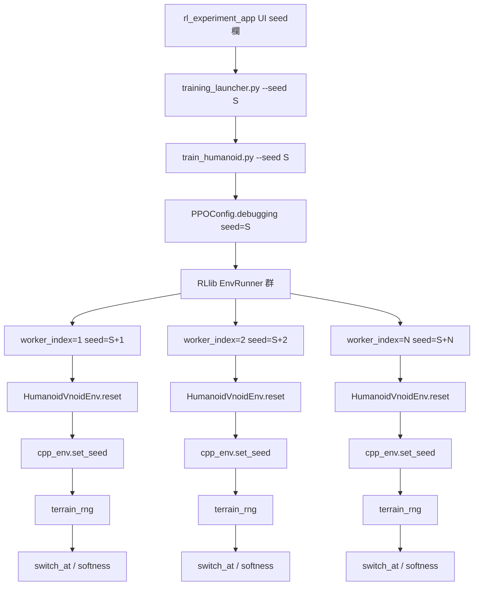
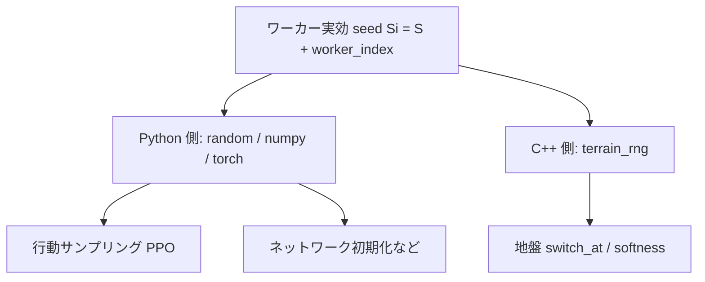
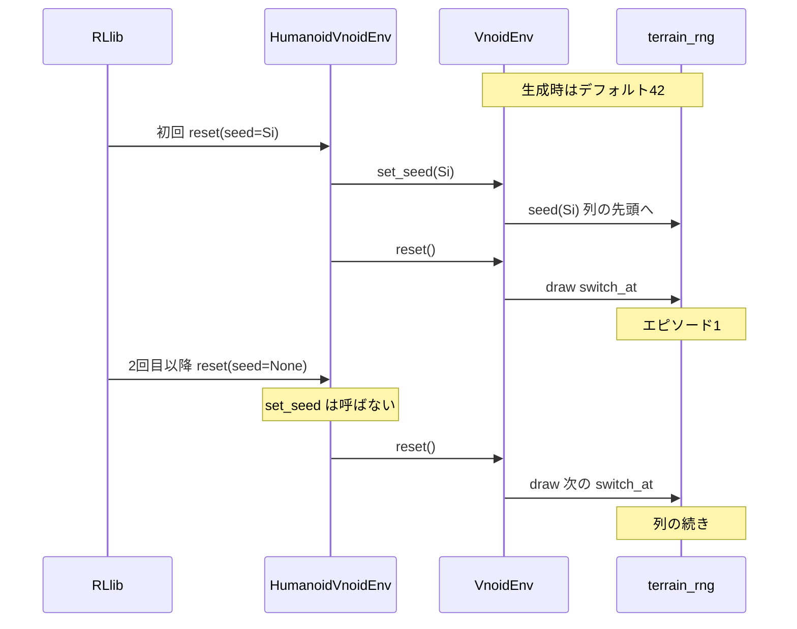
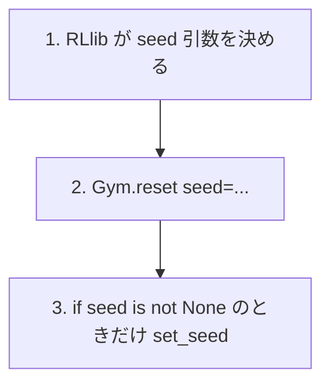
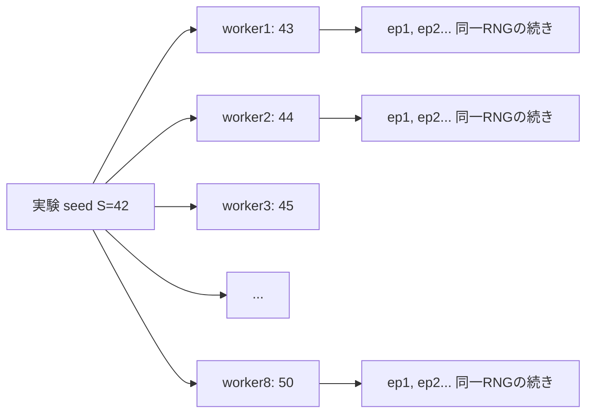
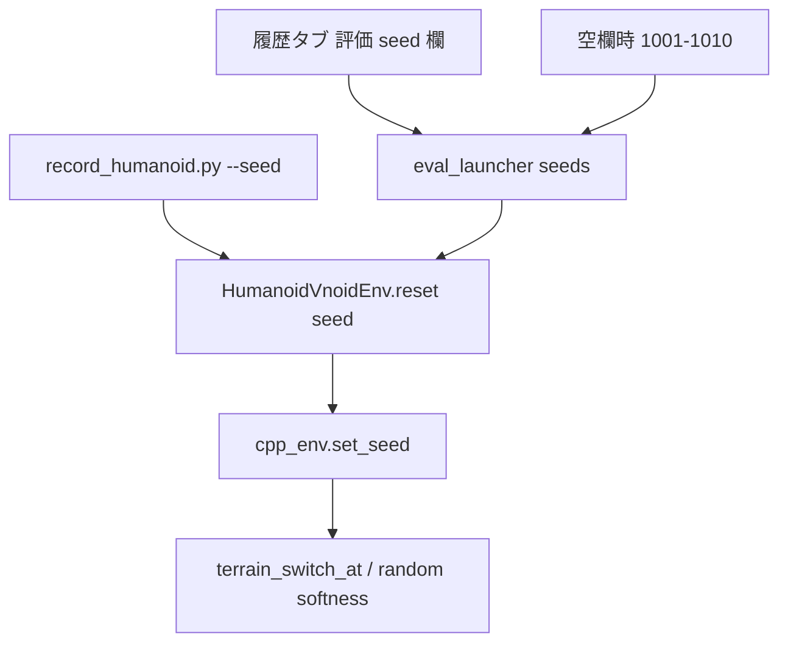

# Seed 伝播アーキテクチャ

学習・評価における乱数 seed の流れと、8並列時の枝分けをまとめる。  
対象は主に **地盤条件の乱数**（切替タイミング / `random` softness）。GPU 学習のビット一致は対象外。

## 全体フロー（学習）



要点:

- UI の seed は `rl_experiment_app/training_launcher.py` 経由で `--seed` になる
- `python_scripts/train_humanoid.py` が `.debugging(seed=args.seed)` で RLlib に渡す
- RLlib が各ワーカーで `Si = S + worker_index` に分岐（Ray `env_runner.py`）
- `python_scripts/my_humanoid_env.py` が `seed is not None` のときだけ `cpp_env.set_seed(seed)` を呼ぶ
- C++ `VnoidEnv::set_seed` が `terrain_rng` をその列の先頭へ巻き戻す

## 「再シード」とは

`terrain_rng` は C++ の `std::mt19937`。呼ぶたびに次の数が出る。

```cpp
void VnoidEnv::set_seed(uint32_t seed) {
    terrain_seed = seed;
    terrain_rng.seed(seed);  // 「seed から始まる列」の先頭へ
}
```

再シード = 途中から続けるのではなく、指定 seed の列の先頭に戻すこと。  
C++ `set_seed` が触るのは地盤用 `terrain_rng` だけ（`terrain_switch_at` と `--terrain random` の softness）。

### C++ 側の初期化

1. メンバ初期化: `terrain_seed = 42` / `terrain_rng{42}`（seed 未配線時のフォールバック）
2. 学習時の初回 `reset`: Python から `set_seed(Si)` で実験 seed に差し替え

本番の地盤 seed 入口は **`set_seed` のみ**。デフォルト 42 はヘッダのメンバ初期化に1箇所だけ置く。

## 地盤と行動探索は別 RNG（二本以上の列）

どちらも実験 seed `S` が起点だが、**同じ数値で初期化した別オブジェクト**であり、一本の列から交互に取るのではない。



| 用途 | 乱数オブジェクト | 誰が seed するか | 共有？ |
|------|------------------|------------------|--------|
| 地盤 | C++ `terrain_rng` | `set_seed(Si)` | 否 |
| 行動探索 | PyTorch RNG | RLlib `update_global_seed_if_necessary(Si)` | 否 |
| Gymnasium `np_random` | Python Env RNG | `super().reset(seed=Si)` | 否（現状ほぼ未使用） |

学習で回る乱数の主なもの:

1. 地盤（C++）— 本ドキュメントの再現対象
2. 行動探索（PyTorch）— RLlib が別途 seed。録画は mean 利用で実質決定的
3. Learner の SGD 等 — 別経路。GPU 非決定性もありビット一致は狙わない

## ワーカー内の時間軸



- `mjData` / `MyRobot` は毎 reset で作り直し
- `terrain_rng` はワーカー寿命中ずっと生きる
- 2エピソード目以降は乱数列が前進する（多様性）

## 表 → コード対応（再シードはどこで止まるか）

**毎 reset で Python→C++ に行くのは `cpp_env.reset()`（物理やり直し）であって、seed ではない。**



### 1. RLlib（None を渡す側）

Ray `single_agent_env_runner.py` の `_reset_envs`:

```python
# Only seed (if seed provided) upon initial reset.
seed=self._seed if self._needs_initial_reset else None,
```

| `_needs_initial_reset` | 渡る `seed` |
|------------------------|-------------|
| True（初回） | `self._seed` = `S + worker_index` |
| False（以降） | `None` |

### 2. Python ゲート

`python_scripts/my_humanoid_env.py`:

```python
def reset(self, seed=None, options=None):
    super().reset(seed=seed)
    if seed is not None:
        self.cpp_env.set_seed(int(seed))  # seed=None ならスキップ
    obs = self.cpp_env.reset()            # 毎 reset 呼ばれる
```

| 呼び出し | `seed` | `set_seed` | `cpp_env.reset()` |
|----------|--------|------------|-------------------|
| 初回 | `Si` | 実行 | 実行 |
| 2回目以降 | `None` | スキップ | 実行 |

### 3. C++ `reset()` は RNG を巻き戻さない

`controller/vnoid_rl_env/vnoid_env_episode.cpp`:

```cpp
terrain_switch_at = dist(terrain_rng);  // 列の次を取るだけ
```

なぜ初回だけ seed か: Gymnasium / RLlib の標準。再現の起点を一度決め、以降は列を進めて多様性を保つ。毎 reset で同じ `Si` に戻すと切替タイミングが固定され学習が偏る。

## S=42, 8並列の枝分け



別 trial で `S=43` にすると worker seed は 44〜51 になり、`S=42` の 44〜50 と7個重なる。  
独立 trial にするなら `S` を `num_workers` 刻み（42, 50, 58...）にする。

## 評価・録画



- 履歴タブで評価 seed をカンマ区切り指定できる（例: `1001,1002,1003`）
- **空欄**のときは全モデル共通の固定セット **1001–1010**（論文比較用）
- 出力ファイルと DB の `terrain_mode` は `seed1001_softness_0.40` 形式で seed ごとに分かれる
- 学習中の「ワーカー別・エピソード進行後」までは再現しない
- 空欄デフォルトは 10 seed × softness グリッドなので録画回数が多い点に注意

## 関連ファイル

| 役割 | パス |
|------|------|
| UI → CLI | `rl_experiment_app/training_launcher.py` |
| RLlib seed | `python_scripts/train_humanoid.py` |
| Python → C++ | `python_scripts/my_humanoid_env.py` |
| `set_seed` | `controller/vnoid_rl_env/vnoid_env_lifecycle.cpp` |
| 切替タイミング | `controller/vnoid_rl_env/vnoid_env_episode.cpp` |
| random softness | `controller/vnoid_rl_env/vnoid_env_terrain.cpp` |
| 録画 seed / 出力名 | `python_scripts/record_humanoid.py` |
| 評価 seed（複数可） | `rl_experiment_app/eval_launcher.py` / `ui/history_tab.py` |
